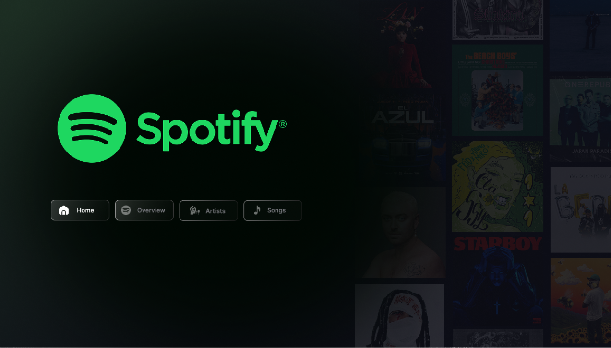
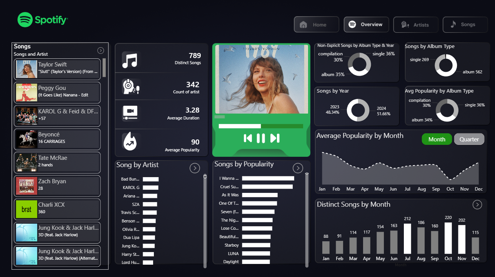
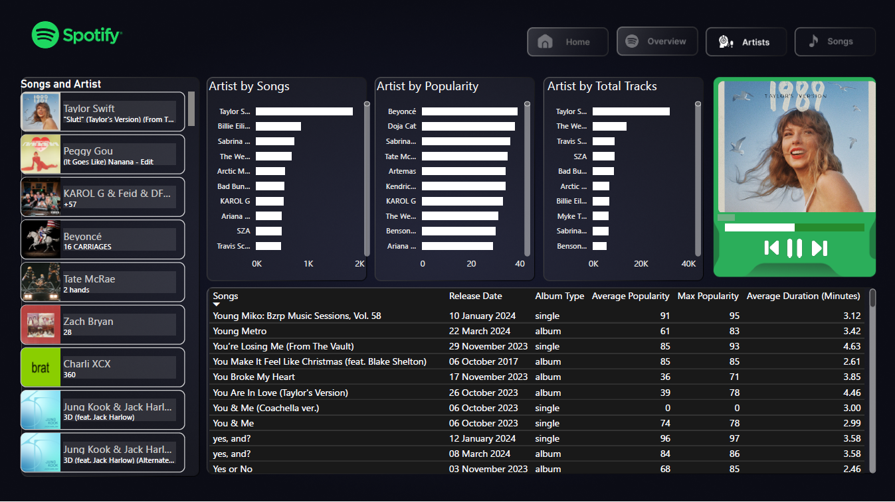
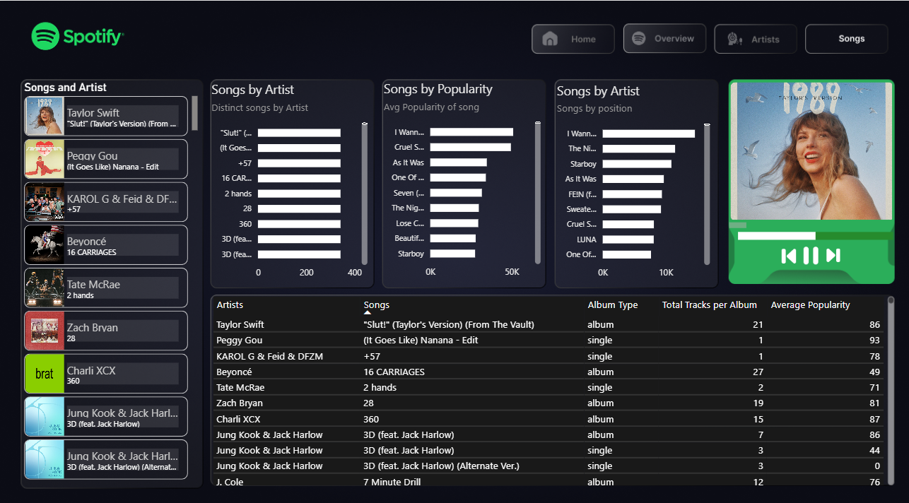

🎧 Spotify Data Analytics Dashboard (Power BI)

📌 Project Overview
This project showcases an interactive Spotify analytics dashboard developed using Power BI to analyze music trends, artist performance, and song-level insights.

The dashboard transforms raw data into meaningful and visually compelling business insights through dynamic and interactive visualizations.

🛠️ Tools & Technologies Used
- Power BI
- Data Cleaning
- Data Visualization
- DAX (Data Analysis Expressions)
- Data Modeling

  

📊 Dashboard Preview

🏠 Home Page

📈 Overview Dashboard (Key Insights)

🎤 Artist Analysis

🎵 Songs Analysis

🎯 Project Objectives
- Analyze Spotify streaming data trends
- Identify top-performing artists and tracks
- Build an interactive and user-friendly dashboard
- Provide actionable insights through data visualization

💡 Key Features
- Interactive filters and slicers
- KPI metrics for performance tracking
- Trend analysis visuals
- Clean and professional dashboard design
